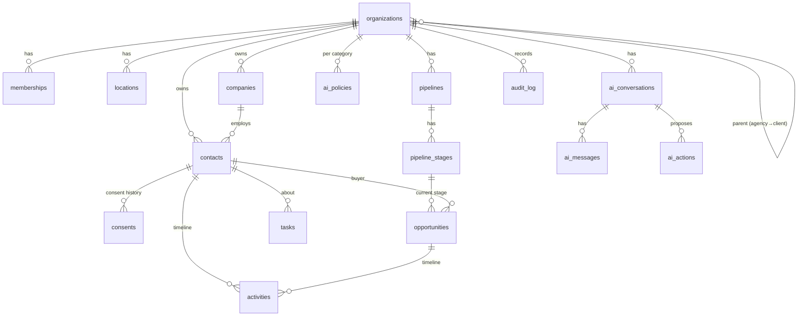

# Database Schema

Postgres 17 on Supabase (project `sunsite-hub`). All tables live in `public` with RLS enabled.

## Conventions (all new tables)

- `id uuid primary key default gen_random_uuid()`
- `organization_id uuid not null`, plus `unique (id, organization_id)` on any table others reference
- **Composite foreign keys** `(child_id, organization_id) → parent(id, organization_id)`, so a row can only reference rows in the same tenant
- `created_at` / `updated_at timestamptz` with the `tg_set_updated_at` trigger; `created_by uuid` where a person creates rows
- Enumerations as `text` + `check` constraints (easy to extend in a migration)
- Bounded text (`check (length(x) <= n)`) and `jsonb_typeof` checks on JSON columns
- RLS policies call `public.org_rank(organization_id)`. Standard ladder: viewer reads (≥1), member writes (≥2), manager deletes (≥3), admin configures (≥4)
- `revoke all … from anon`; explicit grants to `authenticated` and `service_role`
- Security-definer functions use `set search_path = ''` and fully qualified names

---

## 1. Current live schema (audit)

35 tables. RLS on all of them; every policy is `app_secret_ok()` (shared header secret), except `team_members`, which also lets a user read their own row.

| Domain | Tables | Notes |
|---|---|---|
| Prospecting | `businesses` (63 rows), `audits`, `report_events`, `business_contact_evidence`, `seo_tasks` | Agency's own prospects; no tenant column |
| Outreach | `interactions`, `proposals` | `interactions` sent by the 15-minute cron |
| Reputation | `review_campaigns`, `review_feedback` | Public pages read through server routes |
| Websites | `website_rebuilds` | Concept sites |
| Lead marketplace | `leads`, `lead_partners`, `lead_offers`, `lead_wallet_transactions`, `lead_call_events` | `claim_lead()` row-locks atomically |
| Receptionist | `receptionist_clients`, `receptionist_calls` | Vapi IDs stored per client |
| Email | `email_contacts`, `email_templates`, `email_campaigns`, `email_deliveries` | |
| Campaign Studio | `studio_workspaces`, `studio_campaigns`, `studio_contacts`, `studio_sessions`, `studio_events`, `studio_followups`, `studio_limits` | Workspace concept (1 row); provider routing by env var workspace ID |
| Agents | `agent_jobs`, `agent_improvements`, `agent_workers` | Local Ollama worker |
| Platform | `app_settings` (single row), `app_secrets` (encrypted provider keys), `team_members` (0 rows) | |

**Functions:** `app_secret_ok()` (**contains the shared secret as a literal**, see SECURITY_PLAN S1), `claim_lead`, `studio_*` (4), `touch_updated_at`.

**Drift:** 17 migrations are applied in production, but only 6 exist in `supabase/migrations/`. Missing from version control: `init_sunsite_schema`, `temp_test_policies`, `header_secret_policies`, `add_encrypted_app_secrets`, `add_website_rebuilds`, `expand_website_rebuilds_into_profession_improver`, `roofing_lead_engine_v1`, `roofing_lead_claim_function`, `create_site_drafts`, `drop_site_drafts_revert`, `add_agent_job_scheduling`. Several repository files also carry timestamps that differ from the applied versions.

**Action (Phase 1b):** `supabase db pull` → `supabase/migrations/<ts>_baseline.sql`; mark it applied with `supabase migration repair`, then keep repository and production in lockstep (CI check).

---

## 2. Phase 1 schema (migration `20261006120000_phase1_tenancy_crm_ai.sql`)

### 2.1 Entity relationships

### 2.2 Tables

| Table | Purpose | Key columns / constraints |
|---|---|---|
| `organizations` | Tenant | `kind` agency/client; client ⇒ `parent_id` required; `status` active/suspended/closed; `slug` unique; `branding`, `settings` jsonb; `plan` |
| `locations` | Business locations | `organization_id`, `name`, `address` jsonb, `timezone` |
| `memberships` | User ↔ org role | PK `(organization_id, user_id)`; `role` owner…viewer; `status` active/disabled; guard trigger |
| `companies` | Accounts | `name`, `domain`, `industry`, `address`, `custom_fields`; `legacy_business_id` unique per org (import idempotency) |
| `contacts` | People / leads / customers | names, validated `email`/`phone`, `source`, `owner_id`, `lifecycle_stage`, `lead_score` 0–100 + `score_factors` (explanations), `tags[]` (GIN), `custom_fields`, `do_not_contact`, `last_activity_at`, `erased_at` |
| `custom_field_definitions` | Schema for `custom_fields` | `(organization_id, object_type, key)` unique; `field_type` text/number/date/boolean/select/url |
| `consents` | **Append-only** consent ledger | `channel` sms/email/voice/whatsapp, `status` granted/revoked, `source`, `evidence`, `captured_by`, `captured_at`; newest row per channel wins; no update/delete policy |
| `pipelines` | Sales pipelines | one `is_default` per org (partial unique index) |
| `pipeline_stages` | Ordered stages | `position` unique per pipeline (deferrable), `probability`, `kind` open/won/lost |
| `opportunities` | Deals | `stage_id` FK constrained to the same pipeline; `value_cents`, `currency`, `status` derived from stage kind; `stage_entered_at`, `closed_at` maintained by trigger |
| `tasks` | Follow-ups | `status`, `priority`, `due_at`, `assignee_id`, links to contact/deal |
| `activities` | Unified timeline (customer memory) | `kind` note/call/sms/email/chat/meeting/task/stage_change/form/review/payment/system/ai; `direction`; `sensitive` (hidden from AI); `actor_type` user/ai/system/contact |
| `ai_policies` | AI permission per category | PK `(organization_id, category)`; `mode` observe/recommend/approve/auto |
| `ai_conversations`, `ai_messages` | Operator chats | Private to their user (RLS) |
| `ai_actions` | Every change the AI proposes | `tool`, `category`, `summary`, immutable `input`, `status`, `policy_mode`, `result`, `error`, `requested_by`, `decided_by/at`, `executed_at` |
| `audit_log` | Append-only audit | identity PK; `actor_type` user/ai/system/api; immutable to every API role, including `service_role` |

### 2.3 Functions and triggers

| Function | Kind | Purpose |
|---|---|---|
| `org_rank(org)` | definer, stable | Effective rank 0–5 for `auth.uid()`: direct membership, or parent-agency membership capped at admin; suspended ⇒ ≤ viewer; closed ⇒ 0 |
| `has_org_role(org, role)`, `role_rank(role)` | helpers | |
| `can_manage_owners(org)` | definer | Owner of the org, or admin of its parent agency |
| `my_organizations()` | definer | Org switcher list with effective role |
| `create_organization(name, kind, parent)` | definer | Agencies: platform staff only; clients: agency admins. Seeds defaults and writes audit |
| `seed_organization_defaults(org)` | definer, internal | Default 7-stage pipeline; conservative AI policies (crm/pipeline/tasks = approve, messaging/campaigns/workflows/reputation = recommend, billing = observe) |
| `add_member_by_email(org, email, role)` | definer | Admin-only; bounded by the caller's own rank |
| `log_audit(...)` | definer | Only way for users to write audit entries; actor is always `auth.uid()` |
| `erase_contact(contact)` | definer | Admin-only right-to-erasure; revokes all consent; audited |
| `import_legacy_businesses(org)` | definer | Platform staff + org admin; idempotent copy of `businesses` into companies/contacts |
| `tg_memberships_guard` | trigger | No granting above own rank; owner changes by owner-managers only; never remove the last owner; identity immutable |
| `tg_ai_actions_guard` | trigger | Insert status must match org policy; payload immutable; pending → approved/rejected by manager+; only the approver executes; no skipping states |
| `tg_audit_immutable` | trigger | Blocks update/delete for API roles |
| `tg_opportunity_stage`, `tg_opportunity_stage_activity` | triggers | Status/closed_at from stage; stage changes appended to timeline |
| `tg_activity_touch_contact` | trigger | Maintains `contacts.last_activity_at` |

### 2.4 Verified properties (supabase/tests/phase1_rls.test.sql, 54 assertions)

Cross-tenant reads, writes and links are impossible; viewers can't write; managers can't self-promote or change AI policies; client owners can't see their parent agency; the AI cannot pre-approve, skip approval or alter a payload; the audit log is immutable even to `service_role`; erasure works and is admin-only; legacy import is idempotent and staff-only; suspended orgs are read-only, including their clients.

---

## 3. Planned schema by phase

### Phase 2: Communications (part 1 implemented: `20261007120000_phase2_communications.sql`)

| Table | Purpose | Key rules |
|---|---|---|
| `provider_accounts` | An organization's sending number/address per channel and provider | `address` unique among active accounts (inbound routing); one default per channel; `encrypted_credentials` not selectable via the API (column grants) and released only by `provider_secret()` to members+ |
| `conversations` | One thread per contact per channel | unique (org, contact, channel); unread count and preview maintained by trigger |
| `messages` | Every inbound/outbound message, including blocked and scheduled attempts | API users may only insert outbound `queued`/`scheduled`/`blocked` as themselves and walk `queued→sending→sent/failed`, `scheduled→cancelled/queued`; body frozen once sent; delivery and inbound only via service role; `(provider, provider_message_id)` unique; every insert lands on the timeline |
| `suppressions` | Opted-out numbers/addresses | written only by `apply_opt_out()` (member or service role) and cleared by `clear_opt_out()` (admin or the person's own START text) |
| `webhook_events` | Webhook idempotency log | unique (provider, event_id); service role only |

Planned for the rest of Phase 2:
- `provider_accounts (organization_id, capability, provider, encrypted_credentials, is_default, health jsonb)`, inherited from the parent agency when absent
- `phone_numbers (e164, provider_account_id, capabilities, assigned_to, messaging_profile_id)`
- `messaging_profiles` (10DLC brand/campaign IDs, status, use case)
- `conversations (contact_id, channel, status, assignee_id, last_message_at, unread_count)`
- `messages (conversation_id, direction, channel, body, media, status, provider, provider_message_id unique, cost_micros, error)`; each message also written to `activities`
- `calls (direction, from, to, agent_id, provider, duration_s, cost_micros, outcome, sentiment, intent, transcript, recording_path, appointment_id)`
- `voice_agents (name, purpose, voice_provider, voice_id, llm, prompt_version_id, knowledge_scope, transfer_rules, hours)`
- `suppression_list (organization_id, channel, address, reason)`, `quiet_hours` in `organizations.settings`
- `domain_events` (outbox) and `webhook_events (provider, provider_event_id unique, payload, processed_at)`

### Phase 3 (part 1 implemented: `20261008120000_phase3_reputation_calendars_workflows.sql`)

| Table | Purpose and key rules |
|---|---|
| `domain_events` | Outbox written only by triggers (contact created, tag added, lifecycle and deal stage, inbound message, appointment states, review, private feedback). Managers can read it; the workflow engine claims rows with the service role. A statement that inserts more than 25 contacts emits no `contact.created` events, so imports never start automations |
| `review_sources` | Public review links (https only), managed by managers |
| `reviews` | Rating, text and author are immutable through the API; `sentiment` is generated from the rating; reply `draft` → `posted` records who replied and when. A review of 1–2 stars creates a high-priority task |
| `review_requests` | Random 36-hex token, 60-day expiry. Staff cannot write a customer's response; `review_request_respond()` (service role only) records open, rating once, and site clicks, and creates a task for ratings of 3 or lower |
| `calendars`, `calendar_members` | Rules (hours, buffers, notice, horizon, daily limit), unique public slug; members must belong to the organization or its agency |
| `appointments` | `exclude using gist (resource_key, tstzrange)` for booked and confirmed appointments. `resource_key` is the assignee, or the calendar when unassigned. Status machine: booked → confirmed / cancelled / completed / no_show. Only upcoming appointments move; reminders and public/workflow sources are system-only. Timeline entries and events come from a trigger |
| `workflows`, `workflow_versions` | Versions are insert-only and numbered by the database; activating needs a manager and pins `active_version_id` (a composite foreign key keeps it within the same workflow); `trigger_type` is derived from the active version |
| `workflow_runs`, `workflow_run_logs` | At most one active run per (workflow, contact) through a partial unique index. People can only stop runs; the engine writes everything else |

`ai_policies.category` gains `calendar` (seeded as `approve` for new and existing organizations). Verified by `supabase/tests/phase3_growth.test.sql` (49 assertions, including contact deletion; 134 in total).

Original plan, for reference:
- Reputation: `review_sources`, `reviews (source, external_id unique, rating, body, author, published_at, sentiment, response, responded_at, response_by)`, `review_requests`, `reputation_snapshots (date, score, factors)`
- Calendars: `calendars (type individual/round_robin/team/service/location)`, `calendar_members`, `availability_rules`, `appointments (status, contact_id, starts_at, ends_at, location_id, source)`, `waitlist_entries`, `external_calendar_links`
- Workflows: `workflows`, `workflow_versions (graph jsonb, published)`, `workflow_runs`, `workflow_run_steps` (idempotency key per step)

### Phase 4 (part 1 implemented: `20261009120000_phase4_lead_engine.sql`)

| Table | Purpose and key rules |
|---|---|
| `prospect_searches` | Log of directory searches per organization |
| `prospects` | Businesses (not CRM contacts) with directory data, audit-derived signals, `opportunity_score` and `score_factors`, found `emails` with their source page, `business_email`, `do_not_contact` (only admins can clear it) and links to the CRM company and contact after conversion. A directory listing is unique per organization |
| `prospect_audits` | Audit history: grade, category scores and top findings |
| `outreach_messages` | Drafts are editable. `draft → sending` is claimed by the sender, and the database re-checks do-not-contact and the suppression list. Only the sender records `sent`/`failed`, and sent mail is frozen. The `unsubscribe_token` column is not readable through the API: `outreach_unsubscribe_token()` gives it only to the sender while their own send is in flight. `outreach_unsubscribe()` (service role) suppresses the address, flags the prospect, cancels pending drafts and, for converted prospects, revokes email consent through `apply_opt_out` |

Verified by `supabase/tests/phase4_leads.test.sql` (21 assertions; 155 in total).

### Phase 5 (part 1 implemented: `20261010120000_phase5_sites_forms_knowledge.sql`)

| Table | Purpose and key rules |
|---|---|
| `forms` | Field definitions and settings; globally unique public link; managers create and edit |
| `form_submissions` | Written only by the service role (public endpoint). A trigger counts them, writes the contact timeline and emits `form.submitted`. Stores a hashed IP, never the raw address |
| `sites` | Status draft → published by managers only (who and when recorded) |
| `site_pages` | `draft` (anyone ≥ member) and `published` (managers only). The database refuses a publish that is not an exact copy of the current draft; drafts never change the live page |
| `knowledge_items` | Versioned; approval by managers only; content edits re-open approval; generated `tsvector` with GIN index; `search_knowledge()` returns approved items only |

Verified by `supabase/tests/phase5_sites.test.sql` (22 assertions; 177 in total).

### Phase 5 (planned remainder)
- Original Phase 4 note, kept for reference: `prospect_searches`, `prospects (org-scoped)`, `prospect_audits` (link to `audits`)
- `sites`, `pages`, `forms`, `form_submissions`, `templates`
- `knowledge_items (type, content, version, status draft/approved, approved_by)` with `pgvector` embeddings

### Phase 6 (part 1 implemented: `20261011120000_phase6_business_layer.sql`)

| Table / function | Purpose and key rules |
|---|---|
| `organizations` guard (fix) | The API can no longer change `kind`, `parent_id`, `slug`, `created_by`, `status` or `plan`; `govern_organization()` changes plan and status for platform staff or the parent agency's admins |
| `plans` | Platform plans (`internal`, `starter`, `growth`, `pro`) and agency-owned plans; `limits` jsonb per metric; `organizations.plan` references it. New accounts default to `internal` (no limits) |
| `usage_events`, `org_usage()` | Metered by triggers: texts and emails sent, AI requests, outreach sent. `check_plan_limit()` raises SQLSTATE 53400 before a message is queued, an AI request is made, outreach is sent, or a contact, member or site is added over the limit |
| `payment_accounts` | The organization's own Stripe credentials, encrypted; column grants hide them; `payment_secret()` for managers (server use) |
| `invoices` | Invoices and estimates; totals, tax and deposit computed in the database; numbers `INV-`/`EST-` per org; restricted status transitions; paid invoices cannot be edited; random public token |
| `payments` | Card payments (service role, unique per provider id) and manual payments (managers); none on drafts, estimates or void invoices; a trigger recomputes amount paid and status |
| `site_domains`, `site_slug_for_domain()` | Custom domains with a verification token; only the service role marks a domain verified; the lookup returns verified domains of published sites only |

Verified by `supabase/tests/phase6_business.test.sql` (30 assertions; 207 in total).

### Phase 6 (part 2 implemented: `20261012120000_phase6b_agency_operations.sql`)

| Table / function | Purpose and key rules |
|---|---|
| `plans.audience`, `plans.stripe_price_id` | Client plans vs agency plans (`agency-solo/growth/scale`, `agency-inactive`); agency plans limit `client_accounts`, enforced on creating or receiving a client. `govern_organization` refuses a plan for the wrong kind of account |
| `platform_subscriptions` | One per agency; written only by the server from verified Stripe webhooks; readable by the agency's admins |
| `client_billing`, `client_billing_runs`, `usage_for_period()` | Agency rates per client (plan fee, cents per text/email/AI request/outreach email, tax, automatic monthly); one run per client and month; the bill-to contact must be in the agency's own CRM |
| `invitations`, `create_invitation()`, `accept_invitation()`, `invitation_preview()` | Only a SHA-256 hash of the token is stored; 7-day expiry; inviter rights and seat limit checked; the accepting account's email must match; previews are server-only |
| `org_transfers`, `request_transfer()`, `decide_transfer()` | Moving a client between agencies needs the receiving agency's acceptance and, when the client has an owner, the owner's consent; completion moves the account, resets an agency-owned plan to `starter` and removes the old agency's billing settings |
| `app_domains`, `brand_for_domain()` | An agency's console domain; server-only verification; a host name can be either a website domain or a console domain, never both |

Verified by `supabase/tests/phase6b_agency.test.sql` (40 assertions; 247 in total).

### Reputation: Google (`20261013120000_reputation_google.sql`)

| Table / function | Purpose and key rules |
|---|---|
| `review_connections` | One Google connection per organization; refresh token encrypted and not readable through the API; admins choose the location; sync state is written only by the server |
| `review_widgets`, `review_widget_data()` | Embeddable widgets with random addresses; the public data always includes the true average and count of all reviews, shows first names only, and disabled widgets show nothing |
| `tg_reviews_created` (changed) | Reviews older than 14 days (imported history) go on the timeline but no longer open tasks or start automations |

Verified by `supabase/tests/reputation_google.test.sql` (20 assertions; 267 in total).

### AI receptionist (`20261014120000_voice_receptionist.sql`)

| Table | Purpose and key rules |
|---|---|
| `voice_agents` | A provider assistant (Vapi) per business: encrypted API key and webhook secret (not readable through the API), settings (calendar, transfer number, messages, missed-call text), the assistant's previous tools for restoring; one business per assistant |
| `calls` | Written only by the server from verified webhooks; one row per provider call; people can only mark reviewed, add a note or relink the contact; managers delete. Finished calls go on the contact timeline and emit `call.completed` (automation trigger with an outcome filter) |

Also: an inbound call from a contact now counts like an inbound text for the 24-hour transactional reply rule (missed-call text-back), never for marketing.

Verified by `supabase/tests/voice_receptionist.test.sql` (17 assertions; 284 in total).

### Phase 7–8 (planned)
- `price_overrides` (per-client price overrides beyond the current rates)
- `sender_domains`
- `metrics_daily`, `touchpoints`, `ad_accounts`, `ad_spend_daily`
- `affiliates`, `referral_links`, `referrals`, `commission_rules`, `payouts`
- `marketplace_listings`, `installs`, `bundles`

---

## 4. Legacy migration strategy

Legacy tables move to tenancy one module at a time, without downtime:

1. Add `organization_id uuid` (nullable) with a composite FK; backfill to the platform agency.
2. Add RLS policies on `org_rank(organization_id)` **alongside** the existing `app_secret_ok()` policy (policies are OR-ed).
3. Switch the module's routes to `tenantRoute` + `userClient`.
4. Set `organization_id not null`; drop the `app_secret_ok()` policy.
5. When no legacy policy remains, drop `app_secret_ok()` and the shared secret entirely.

Order: email center → Campaign Studio (merge `studio_contacts` into `contacts`) → receptionist → reputation → prospecting → lead marketplace.
