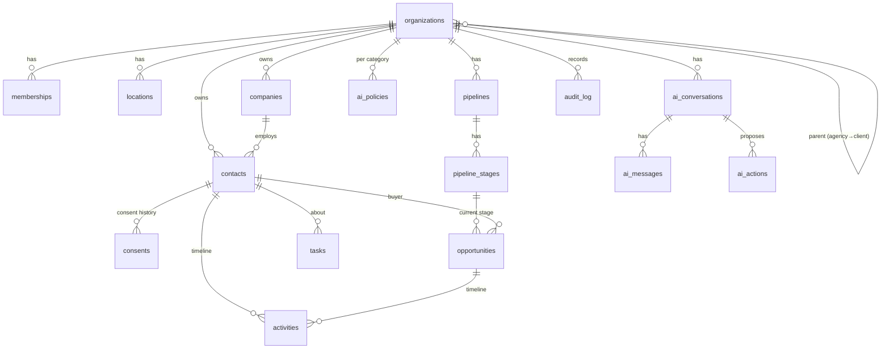

# Database Schema

Postgres 17 on Supabase (project `sunsite-hub`). All tables live in `public` with RLS enabled.

## Conventions (all new tables)

- `id uuid primary key default gen_random_uuid()`
- `organization_id uuid not null`, plus `unique (id, organization_id)` on any table others reference
- **Composite foreign keys** `(child_id, organization_id) → parent(id, organization_id)`, so a row can only reference rows in the same tenant
- `created_at` / `updated_at timestamptz` with the `tg_set_updated_at` trigger; `created_by uuid` where a person creates rows
- Enumerations as `text` + `check` constraints (easy to extend in a migration)
- Bounded text (`check (length(x) <= n)`) and `jsonb_typeof` checks on JSON columns
- RLS policies call `public.org_rank(organization_id)`. Standard ladder: viewer reads (≥1), member writes (≥2), manager deletes (≥3), admin configures (≥4)
- `revoke all … from anon`; explicit grants to `authenticated` and `service_role`
- Security-definer functions use `set search_path = ''` and fully qualified names

---

## 1. Current live schema (audit)

35 tables. RLS on all of them; every policy is `app_secret_ok()` (shared header secret), except `team_members`, which also lets a user read their own row.

| Domain | Tables | Notes |
|---|---|---|
| Prospecting | `businesses` (63 rows), `audits`, `report_events`, `business_contact_evidence`, `seo_tasks` | Agency's own prospects; no tenant column |
| Outreach | `interactions`, `proposals` | `interactions` sent by the 15-minute cron |
| Reputation | `review_campaigns`, `review_feedback` | Public pages read through server routes |
| Websites | `website_rebuilds` | Concept sites |
| Lead marketplace | `leads`, `lead_partners`, `lead_offers`, `lead_wallet_transactions`, `lead_call_events` | `claim_lead()` row-locks atomically |
| Receptionist | `receptionist_clients`, `receptionist_calls` | Vapi IDs stored per client |
| Email | `email_contacts`, `email_templates`, `email_campaigns`, `email_deliveries` | |
| Campaign Studio | `studio_workspaces`, `studio_campaigns`, `studio_contacts`, `studio_sessions`, `studio_events`, `studio_followups`, `studio_limits` | Workspace concept (1 row); provider routing by env var workspace ID |
| Agents | `agent_jobs`, `agent_improvements`, `agent_workers` | Local Ollama worker |
| Platform | `app_settings` (single row), `app_secrets` (encrypted provider keys), `team_members` (0 rows) | |

**Functions:** `app_secret_ok()` (**contains the shared secret as a literal**, see SECURITY_PLAN S1), `claim_lead`, `studio_*` (4), `touch_updated_at`.

**Drift:** 17 migrations are applied in production, but only 6 exist in `supabase/migrations/`. Missing from version control: `init_sunsite_schema`, `temp_test_policies`, `header_secret_policies`, `add_encrypted_app_secrets`, `add_website_rebuilds`, `expand_website_rebuilds_into_profession_improver`, `roofing_lead_engine_v1`, `roofing_lead_claim_function`, `create_site_drafts`, `drop_site_drafts_revert`, `add_agent_job_scheduling`. Several repository files also carry timestamps that differ from the applied versions.

**Action (Phase 1b):** `supabase db pull` → `supabase/migrations/<ts>_baseline.sql`; mark it applied with `supabase migration repair`, then keep repository and production in lockstep (CI check).

---

## 2. Phase 1 schema (migration `20261006120000_phase1_tenancy_crm_ai.sql`)

### 2.1 Entity relationships

### 2.2 Tables

| Table | Purpose | Key columns / constraints |
|---|---|---|
| `organizations` | Tenant | `kind` agency/client; client ⇒ `parent_id` required; `status` active/suspended/closed; `slug` unique; `branding`, `settings` jsonb; `plan` |
| `locations` | Business locations | `organization_id`, `name`, `address` jsonb, `timezone` |
| `memberships` | User ↔ org role | PK `(organization_id, user_id)`; `role` owner…viewer; `status` active/disabled; guard trigger |
| `companies` | Accounts | `name`, `domain`, `industry`, `address`, `custom_fields`; `legacy_business_id` unique per org (import idempotency) |
| `contacts` | People / leads / customers | names, validated `email`/`phone`, `source`, `owner_id`, `lifecycle_stage`, `lead_score` 0–100 + `score_factors` (explanations), `tags[]` (GIN), `custom_fields`, `do_not_contact`, `last_activity_at`, `erased_at` |
| `custom_field_definitions` | Schema for `custom_fields` | `(organization_id, object_type, key)` unique; `field_type` text/number/date/boolean/select/url |
| `consents` | **Append-only** consent ledger | `channel` sms/email/voice/whatsapp, `status` granted/revoked, `source`, `evidence`, `captured_by`, `captured_at`; newest row per channel wins; no update/delete policy |
| `pipelines` | Sales pipelines | one `is_default` per org (partial unique index) |
| `pipeline_stages` | Ordered stages | `position` unique per pipeline (deferrable), `probability`, `kind` open/won/lost |
| `opportunities` | Deals | `stage_id` FK constrained to the same pipeline; `value_cents`, `currency`, `status` derived from stage kind; `stage_entered_at`, `closed_at` maintained by trigger |
| `tasks` | Follow-ups | `status`, `priority`, `due_at`, `assignee_id`, links to contact/deal |
| `activities` | Unified timeline (customer memory) | `kind` note/call/sms/email/chat/meeting/task/stage_change/form/review/payment/system/ai; `direction`; `sensitive` (hidden from AI); `actor_type` user/ai/system/contact |
| `ai_policies` | AI permission per category | PK `(organization_id, category)`; `mode` observe/recommend/approve/auto |
| `ai_conversations`, `ai_messages` | Operator chats | Private to their user (RLS) |
| `ai_actions` | Every change the AI proposes | `tool`, `category`, `summary`, immutable `input`, `status`, `policy_mode`, `result`, `error`, `requested_by`, `decided_by/at`, `executed_at` |
| `audit_log` | Append-only audit | identity PK; `actor_type` user/ai/system/api; immutable to every API role, including `service_role` |

### 2.3 Functions and triggers

| Function | Kind | Purpose |
|---|---|---|
| `org_rank(org)` | definer, stable | Effective rank 0–5 for `auth.uid()`: direct membership, or parent-agency membership capped at admin; suspended ⇒ ≤ viewer; closed ⇒ 0 |
| `has_org_role(org, role)`, `role_rank(role)` | helpers | |
| `can_manage_owners(org)` | definer | Owner of the org, or admin of its parent agency |
| `my_organizations()` | definer | Org switcher list with effective role |
| `create_organization(name, kind, parent)` | definer | Agencies: platform staff only; clients: agency admins. Seeds defaults and writes audit |
| `seed_organization_defaults(org)` | definer, internal | Default 7-stage pipeline; conservative AI policies (crm/pipeline/tasks = approve, messaging/campaigns/workflows/reputation = recommend, billing = observe) |
| `add_member_by_email(org, email, role)` | definer | Admin-only; bounded by the caller's own rank |
| `log_audit(...)` | definer | Only way for users to write audit entries; actor is always `auth.uid()` |
| `erase_contact(contact)` | definer | Admin-only right-to-erasure; revokes all consent; audited |
| `import_legacy_businesses(org)` | definer | Platform staff + org admin; idempotent copy of `businesses` into companies/contacts |
| `tg_memberships_guard` | trigger | No granting above own rank; owner changes by owner-managers only; never remove the last owner; identity immutable |
| `tg_ai_actions_guard` | trigger | Insert status must match org policy; payload immutable; pending → approved/rejected by manager+; only the approver executes; no skipping states |
| `tg_audit_immutable` | trigger | Blocks update/delete for API roles |
| `tg_opportunity_stage`, `tg_opportunity_stage_activity` | triggers | Status/closed_at from stage; stage changes appended to timeline |
| `tg_activity_touch_contact` | trigger | Maintains `contacts.last_activity_at` |

### 2.4 Verified properties (supabase/tests/phase1_rls.test.sql, 54 assertions)

Cross-tenant reads, writes and links are impossible; viewers can't write; managers can't self-promote or change AI policies; client owners can't see their parent agency; the AI cannot pre-approve, skip approval or alter a payload; the audit log is immutable even to `service_role`; erasure works and is admin-only; legacy import is idempotent and staff-only; suspended orgs are read-only, including their clients.

---

## 3. Planned schema by phase

### Phase 2: Communications
- `provider_accounts (organization_id, capability, provider, encrypted_credentials, is_default, health jsonb)`, inherited from the parent agency when absent
- `phone_numbers (e164, provider_account_id, capabilities, assigned_to, messaging_profile_id)`
- `messaging_profiles` (10DLC brand/campaign IDs, status, use case)
- `conversations (contact_id, channel, status, assignee_id, last_message_at, unread_count)`
- `messages (conversation_id, direction, channel, body, media, status, provider, provider_message_id unique, cost_micros, error)`; each message also written to `activities`
- `calls (direction, from, to, agent_id, provider, duration_s, cost_micros, outcome, sentiment, intent, transcript, recording_path, appointment_id)`
- `voice_agents (name, purpose, voice_provider, voice_id, llm, prompt_version_id, knowledge_scope, transfer_rules, hours)`
- `suppression_list (organization_id, channel, address, reason)`, `quiet_hours` in `organizations.settings`
- `domain_events` (outbox) and `webhook_events (provider, provider_event_id unique, payload, processed_at)`

### Phase 3
- Reputation: `review_sources`, `reviews (source, external_id unique, rating, body, author, published_at, sentiment, response, responded_at, response_by)`, `review_requests`, `reputation_snapshots (date, score, factors)`
- Calendars: `calendars (type individual/round_robin/team/service/location)`, `calendar_members`, `availability_rules`, `appointments (status, contact_id, starts_at, ends_at, location_id, source)`, `waitlist_entries`, `external_calendar_links`
- Workflows: `workflows`, `workflow_versions (graph jsonb, published)`, `workflow_runs`, `workflow_run_steps` (idempotency key per step)

### Phase 4–5
- `prospect_searches`, `prospects (org-scoped)`, `prospect_audits` (link to `audits`)
- `sites`, `pages`, `forms`, `form_submissions`, `templates`
- `knowledge_items (type, content, version, status draft/approved, approved_by)` with `pgvector` embeddings

### Phase 6–8
- `plans`, `subscriptions`, `usage_events`, `invoices`, `invoice_items`, `payments`, `refunds`, `price_overrides` (agency markup)
- `domains (hostname unique, organization_id, verified_at)`, `sender_domains`
- `metrics_daily`, `touchpoints`, `ad_accounts`, `ad_spend_daily`
- `affiliates`, `referral_links`, `referrals`, `commission_rules`, `payouts`
- `marketplace_listings`, `installs`, `bundles`

---

## 4. Legacy migration strategy

Legacy tables move to tenancy one module at a time, without downtime:

1. Add `organization_id uuid` (nullable) with a composite FK; backfill to the platform agency.
2. Add RLS policies on `org_rank(organization_id)` **alongside** the existing `app_secret_ok()` policy (policies are OR-ed).
3. Switch the module's routes to `tenantRoute` + `userClient`.
4. Set `organization_id not null`; drop the `app_secret_ok()` policy.
5. When no legacy policy remains, drop `app_secret_ok()` and the shared secret entirely.

Order: email center → Campaign Studio (merge `studio_contacts` into `contacts`) → receptionist → reputation → prospecting → lead marketplace.
